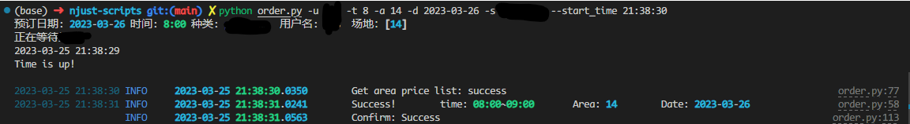

# python-scripts

本仓库包含一个我自己写的自动化订票脚本，取自我自己的私有脚本仓库，移除了部分信息，仅用于简历中的项目展示。


## 1. 安装依赖

```bash
pip install -r requirements.txt
```

## 2. 各脚本用法

### 2.1 订票脚本

#### 2.1.1 用法

```bash
# 用'abc'的账号订 19:00 20:00 21:00 的 3，4，5，6 号场地
python order.py -u abc -t 19 20 21 -a 3 4 5 6
```

#### 2.1.2 说明
> [`order.py`](./order.py) 主程序，提供定时订票功能和命令行界面
> 
> [`private_data.py`](./private_data.py) 保存各类url和用户id信息等

#### 2.1.3 效果图
